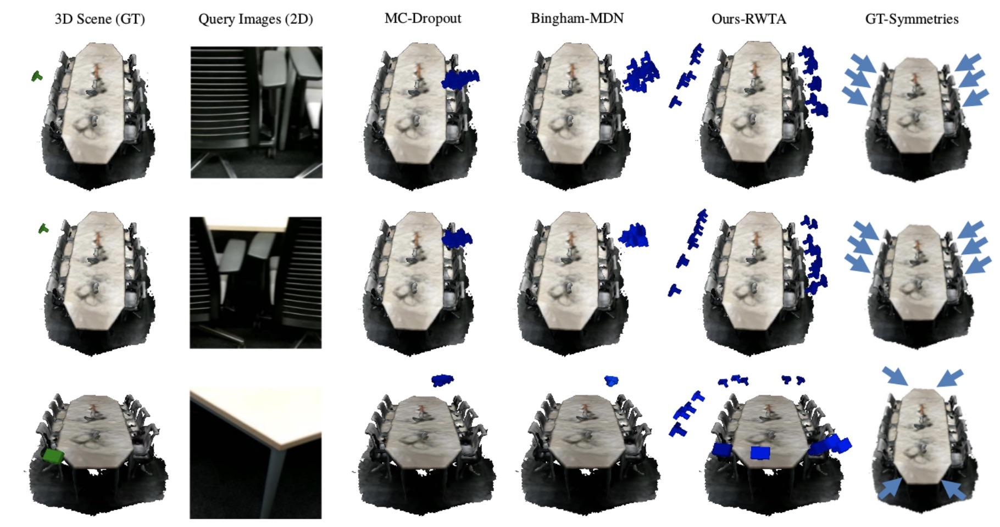

# Uncertainty Aware Methods for Camera Pose Estimation and Relocalization

[Mai Bui](http://campar.in.tum.de/Main/MaiBui),  [Tolga Birdal](http://tbirdal.me/),  [Shadi ](http://campar.in.tum.de/Main/ShadiAlbarqouni) & [Leonidas Guibas](https://profiles.stanford.edu/leonidas-guibas)

[Stanford University](http://www.stanford.edu) & [Technical University of Munich](http://www.tum.de)

 

## Abstract
Camera pose estimation is the term for determining the 6-DoF rotation and translation parameters of a camera. It is now a key technology in enabling multitudes of applications such as augmented reality, autonomous driving, human computer interaction and robot guidance. For decades, vision scholars have worked on finding the unique solution of this problem. Yet, this trend is witnessing a fundamental change. The recent school of thought has begun to admit that for our highly complex and ambiguous real environments, obtaining a single solution is not sufficient. This has led to a paradigm shift towards estimating rather a range of solutions in the form of full probability or at least explaining the uncertainty of camera pose estimates. Thanks to the advances in Artificial Intelligence, this important problem can now be tackled via machine learning algorithms that can discover rich and powerful representations for the data at hand. In collaboration, TU Munich and Stanford University plan to devise and implement generative methods that can explain uncertainty and ambiguity in pose predictions. In particular, our aim is to bridge the gap between 6DoF pose estimation either from 2D images/3D point sets and uncertainty quantification through multimodal variational deep methods.

## Downloads
Links for downloading our paper, slides and datasets will soon be available here.

## Sources
We are planning to make our implementation publicly available on this page.

## Video
To appear...
